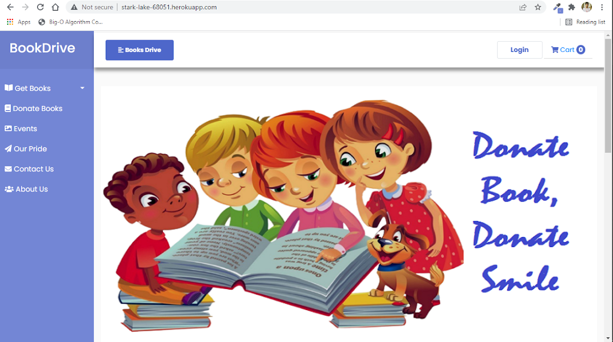

# [BookDrive](http://stark-lake-68051.herokuapp.com/)

### [GitHUB](https://github.com/RkayBhaker/BookDrive) CODE

A web application, where those who have the course books might donate, & those who need them will order. Now we would create a channel to pick up the books from donor & also deliver it to the needful.

## Installation

Open project in Visual Code or use below command to open in installed editor

```bash
  $ code .
```

Install additional dependency using terminal

```bash
  $ composer upgrade
```

After successfully finish above command use below command to run app

```bash
  $ php artisan serve
```

Run app locally in browser

```bash
  http://127.0.0.1:8000/
```

## MongoDB

[](https://account.mongodb.com/account/login?_ga=2.27186813.1330840700.1645023003-106929829.1643112359)

-   [Documentation](https://docs.mongodb.com/)
-   [Sign Up | Login](https://account.mongodb.com/account/login?_ga=2.27186813.1330840700.1645023003-106929829.1643112359)
-   After create cluster connect laravel app using mongodb credentials
-   run blew commands to migrate documents

    ```bash
      $ php artisan migrate
    ```

-   Check the status of above command

    ```bash
      $ php artisan migrate:status
    ```

-   [Laravel database](https://laravel.com/docs/7.x/database)

## Host App on [Heroku](https://dashboard.heroku.com/)

-   [Heroku](https://dashboard.heroku.com/) Refrence
-   [Sign Up | Login](https://id.heroku.com/login)
-   Download [Heroku CLI](https://devcenter.heroku.com/articles/heroku-cli#install-the-heroku-cli) in you local PC
-   After successfully install login in [Heroku](https://dashboard.heroku.com/) using CLI
-   Open Command Line (CMD) and run below command to login

    ```bash
      $ heroku login
    ```

-   After login create app on heroku and push all local code to the heroku app

    ```bash
      $ heroku create app (name of app)
      $ git init
      $ git add .
      $ git commit -m "commit message"
      $ git push heroku master
    ```

-   Check the dashboard on [Heroku Dashboard](https://dashboard.heroku.com/apps)
-   To run this project, you will need to add the following environment variables to your .env file

    -   `APP_KEY`
    -   `APP_DEBUG`
    -   `APP_NAME`

-   Select your app and update your env by click to [Settings](https://dashboard.heroku.com/apps/stark-lake-68051/settings) -> Config Vars
-   Finally, Open your app
-   [Open app](http://stark-lake-68051.herokuapp.com/)

[](http://stark-lake-68051.herokuapp.com/)

## 🛠 Skills

Javascript, HTML, CSS, Bootstrap, PHP, Laravel, MongoDB(Database)

## Contributors

-   [RAKESH](https://github.com/RkayBhaker)
-   [Shuaib](https://github.com/shuaib71)
-   [Pooja Hatankar](https://github.com/poojahatankar15)
-   [Sarwan Kumar](https://github.com/shrawan632)
